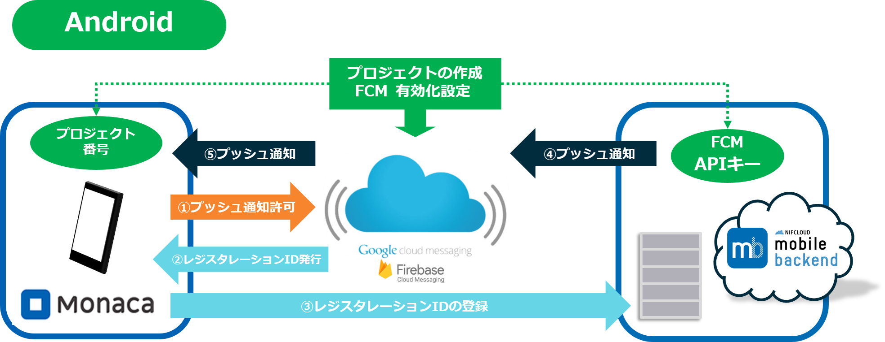
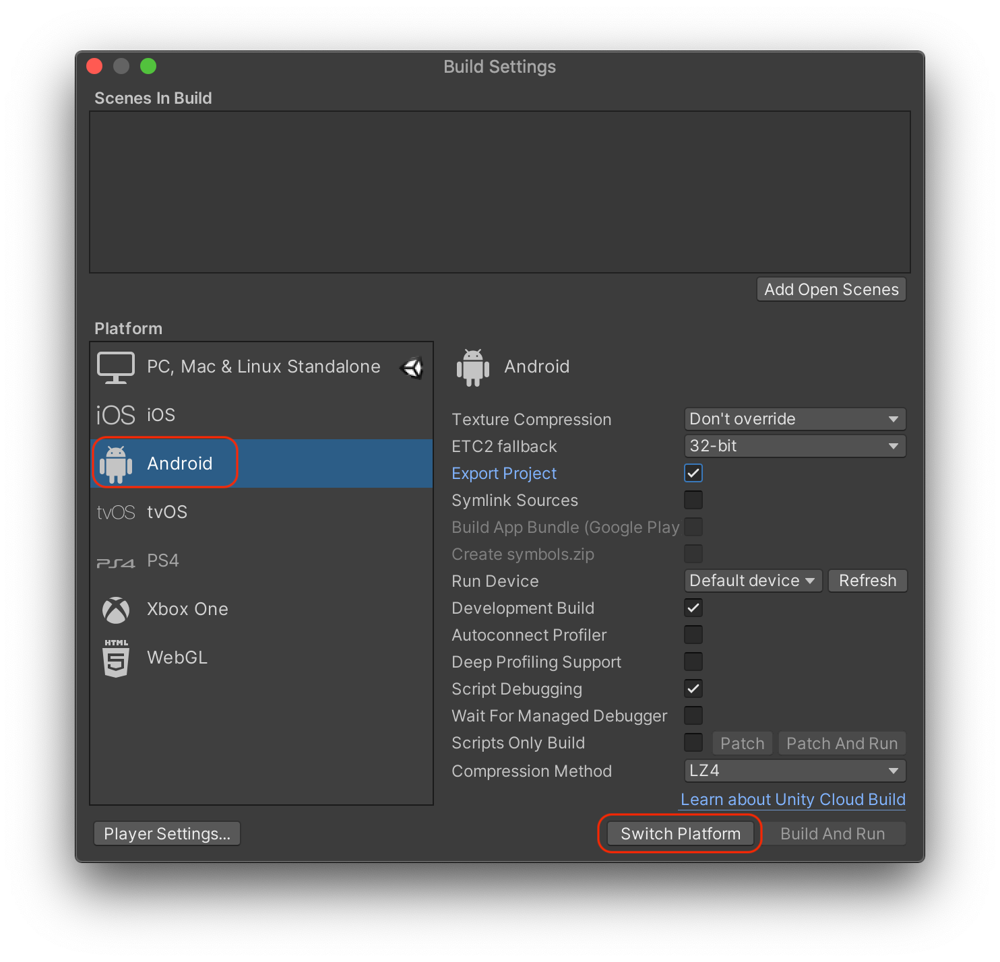
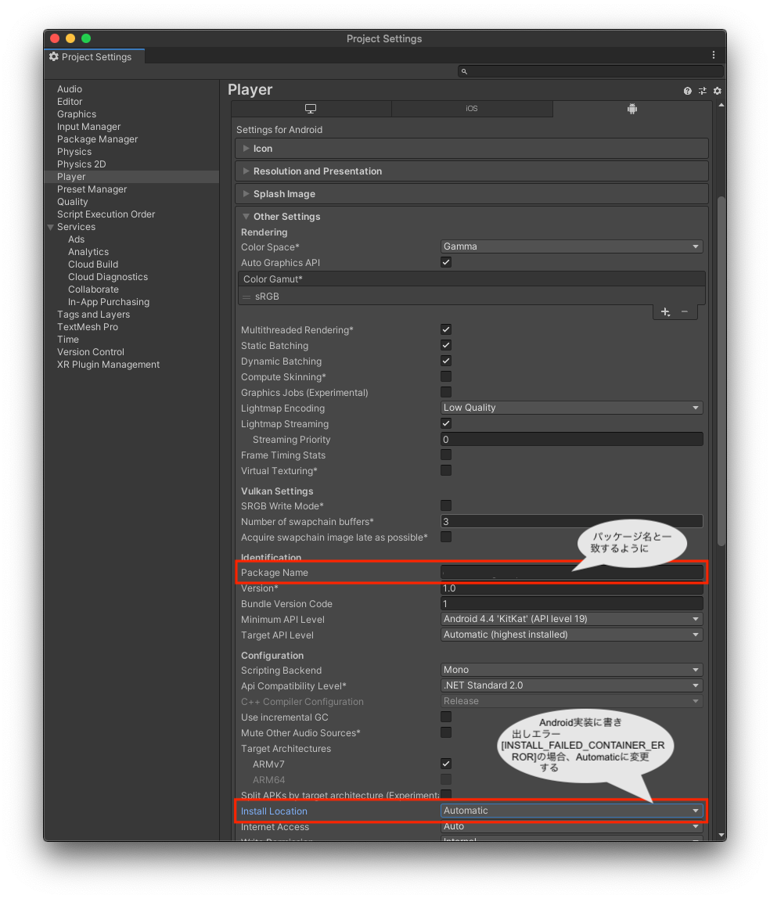

# 【Unity】アプリにプッシュ通知を組み込もう！
_2017/09/13更新_
 

* 本サンプルは不具合がある場合、issue等から報告いただくようにお願いいたします
* 作成日：2016/6（更新日：2020/11）

## 概要
* ニフクラmobile backend の『プッシュ通知』機能を実装したサンプルプロジェクトです https://mbaas.nifcloud.com/
* 簡単な操作ですぐに ニフクラ mobile backend の機能を体験いただけます★☆

## ニフクラmobile backendとは
スマートフォンアプリのバックエンド機能（プッシュ通知・データストア・会員管理・ファイルストア・SNS連携・位置情報検索・スクリプト）が**開発不要**、しかも基本**無料**(注1)で使えるクラウドサービス！

注1：詳しくは[こちら](https://mbaas.nifcloud.com/price.htm)をご覧ください

## 動作環境の準備
### 共通
* Unity開発環境
  * 最新バージョン推奨
* ニフクラ mobile backend 会員登録
  * 下記リンクより登録（無料）をお願いします https://mbaas.nifcloud.com/
* Unity SDK v4.0.4

### Android端末で動作確認をする場合
* Mac OS 12.5.1 (Monterey)
* Android Studio Arctic Fox (2020.3.1)
* Android 12 (Simulator)
* Xcode Version 14.0
* Unity 2020.3.20f1 (LTS)
* iPhone X (iOS 16)
* Unity SDK v4.4.1

### iOS端末で動作確認をする場合
* Mac
  * キーチェーンアクセスを利用します
  * アプリのビルドを行うため、Xcode を使用します（最新バージョン推奨）
* Apple Developer Program (有償)アカウント
  * 別の Mac で使用しているアカウントの場合、発行する証明書に秘密鍵を紐付けることができません。ただし、アカウントを使用している Mac から秘密鍵を書き出して、今回使用するMacに送ることで作業は可能です
* iOS 端末（最新バージョン推奨）
* Lightning ケーブル（端末の UDID を調べるために必要です）

※このサンプルアプリは、実機ビルドが必要です

## プッシュ通知の仕組み
ニフクラ mobile backend のプッシュ通知は、各プラットフォームが提供している通知サービスを利用しています。

__Androidの通知サービス FCM（Firebase Cloud Messaging）__

* FCM は GCM (Google Cloud Messaging)の新バージョンです。既に GCM にてプロジェクトの作成・ GCM の有効化設定を終えている場合は、継続してご利用いただくことが可能です。新規で GCM をご利用いただくことはできませんので、あらかじめご了承ください。

__iOSの通知サービス APNs（Apple Push Notification Service）__

* 上図のように、アプリ（Unity）・サーバー（ニフクラmobile backend）・通知サービス（FCMあるいはAPNs）の間で認証が必要になります
 * 認証に必要な鍵や証明書の作成は作業手順の「0.プッシュ通知機能を使うための準備」で行います

## 作業の手順
### 0. プッシュ通知機能を使うための準備
動作確認を行う端末に応じて該当する内容を準備してください

#### Android端末で動作確認をする場合
 __[Android 端末で動作確認される方はこちら](https://mbaas.nifcloud.com/doc/current/tutorial/push_setup_android.html)__

* ニフクラ mobile backend と連携させるための APIキー(サーバーキー)と端末情報の登録処理時に必要な Sender ID (送信者ID)を取得する必要があります
* 下記リンク先のドキュメントを参考に、FCM プロジェクトの作成と APIキー・Sender IDの取得を行ってください

#### iOS端末で動作確認をする場合
__[iOS 端末で動作確認されるかたはこちら](https://github.com/NIFCLOUD-mbaas/iOS_Certificate)__

* 上記のドキュメントをご覧の上、必要な証明書類の作成をお願いします
* 証明書の作成には[Apple Developer Program](https://developer.apple.com/account/)の登録（有料）が必要です

### 1. [ニフクラ mobile backend](https://mbaas.nifcloud.com/)の会員登録とログイン→アプリ作成
* ニフクラ mobile backend にログインします https://mbaas.nifcloud.com/

* 新しいアプリを作成します
* アプリ名を入力し、「新規作成」をクリックします
  * 例）__PushDemo__

* mobile backend を既に使用したことがある場合は、画面上方のメニューバーにある「+新しいアプリ」をクリックすると同じ画面が表示されます

* アプリ作成されると下図のような画面になります
* この２種類のAPIキー（アプリケーションキーとクライアントキー）は、この後 Unity で作成するアプリとの連携のために使用します

* 続けて、「 __0. プッシュ通知機能を使うための準備__ 」で動作確認端末別に作成した認証キーまたは証明書を設定します

* mobile backend 側の準備は以上です

### 2. [GitHub](https://github.com/NIFCLOUD-mbaas/unity_push_quickstart/archive/master.zi)からサンプルプロジェクトのダウンロード
* まず下記リンクから、プロジェクトをダウンロードします `https://github.com/NIFCLOUD-mbaas/unity_push_quickstart/archive/master.zip`

### 3. Unityでアプリを起動
* ダウンロードした zipファイル を解凍します
* 次に、Unity を起動します
* 「open」をクリックし、ダウンロードしたプロジェクトを指定するとプロジェクトが開きます

### 4. APIキーの設定
* 開いた Unity プロジェクトに、ニフクラ mobile bakcend で発行した APIキー を設定して連携します
* 「Start」シーンを開きます
* 開いたプロジェクトの【Hierarchy】(ヒエラルキービュー)に、「NCMBSettings」と「NCMBManager」オブジェクトを用意します
* 「Create Empty」をクリックしオブジェクトを作成します（２つ）
* 各オブジェクト名称に更新後、【プロジェクト(Project)ビュー】から各ソースをドラッグ＆ドロップして関連付けます

* 【Hierarchy】(ヒエラルキービュー)から作成した「NCMBSettings」オブジェクトを選択し、【inspector】(インスペクタービュー)を開きます
* 先程ニフクラ mobile backend のダッシュボード上で確認したAPIキー(アプリケーションキーとクライアントキー)を貼り付け、「Use Push」にチェックを入れます

### 5. 動作確認
* 動作確認を行う端末に応じて該当する作業を行ってください

#### Android端末で動作確認をする場合
次の手順で .apkファイル を作成し、アプリを端末にインストールします

* Android Manifest を編集します

* `/Assets/Plugins/Android/AndroidManifest.xml`を開き、　__パッケージ名__　（Bundle ID）を設定します
* 「`YOUR_PACKAGE_NAME`」の文字列の部分をパッケージ名（Bundle ID）に書き換えます
  * 一括置換が便利です
* 書き換える箇所は1箇所です

 

* 次にメニューバーの「File」＞「Build Settings」を開きます
* 「Platform」欄から「Android」を選択し、「Switch Platform」ボタンをクリックします

 

* 「Player Settings...」ボタンをクリックし、【Inspector】(インスペクタービュー)を編集します

* 「Bundle Identifier」に先ほど設定した __パッケージ名__ と同じものを設定します
* 「Install Location」には「 __Automatic__ 」を設定します

 

* 設定が終わったら「Build」ボタンをクリックしapkファイルを作成します
  * ファイル名と出力先を指定する必要があります
* 出来上がった .apkファイル を Android端末にインストールします

#### iOS端末で動作確認をする場合
次の手順で Xcodeプロジェクト を作成し、Xcode でアプリを端末にインストールします

##### Unityからプロジェクトの書き出し
* `.xcodeproj`ファイルを作成します
* メニューバーの「File」＞「Build Settings」を開きます
* 「Platform」欄から「iOS」を選択し、「Switch Platform」ボタンをクリックします

 

* この状態で「Build」をクリックすると、`.xcodeproj`ファイルが生成されます
  * ファイル名と出力先を指定する必要があります
* 作成された`.xcodeproj`ファイルをダブルクリックし、Xcode を起動します

##### Xcode でアプリをビルド
* 始めて実機ビルドをする場合は、Xcode に Apple developer アカウント（Apple ID）の登録をします
* メニューバーの「Xcode」＞「Preferences...」を選択します
* Accounts 画面が開いたら、左下の「＋」＞「Add Apple ID...」をクリックします
* 「Apple ID」と「Password」を要求されるので、入力し「Sign in」をクリックします

* 登録されると、下図のようになります
  * 追加した情報があっていればOKです

* 確認できたら設定画面を閉じます
* ここからアプリをビルドするための設定を行います
* 「TARGETS」＞「Unity-iPhone」＞「General」を開きます
* まず「▼identity」＞「Bundle Identifier」に Apple Developer Program で AppID 作成時に設定した、__Bundle ID__ を入力します
  * 注意：必ず同じ Bundle ID を設定してください！
* 次に「▼Signing」を編集します
* 「Automatically manage signing」にチェックを入れた状態で、「Team」を選択します
  * 今回使用する Apple developer アカウントを選択してください

* この２点を設定することで自動的に「Provisioning Profile」が読み込まれます
 * プロビジョニングプロファイルはダウンロードしたものを一度 __ダブルクリック__ して認識させておく必要があります（表示されない場合はダブルクリックを実施してください）
* 次にプッシュ通知の設定をします
* 「Capabilities」を開き、「Push Notifications」を __ON__ に設定します
* 正しく設定が完了すると、以下のように「Steps」にチェックマークが表示されます

* 最後に、再び「General」を開き「Linked Frameworks and Libraries」＞「＋」をクリックして「UserNotifications.framewor」を選択、「Add」をクリックして追加します

* これで設定は完了です
* 登録した動作確認用 iPhone を lightning ケーブルで Mac につなぎます
* Xcode 画面で左上で、接続した iPhone を選び、実行ボタン（三角の再生マーク）をクリックし、端末にアプリをインストールします

#### 動作確認
* インストールしたアプリを起動します
  * __注意__：プッシュ通知の許可を求めるアラートが出たら、必ず許可してください！
* 起動されたらこの時点で Android端末 は レジスタレーションID、iOS端末 は デバイストークン が取得され、ニフクラ mobile backend に保存されます
* ニフクラ mobile backend のダッシュボードで「データストア」＞「installation」クラスを確認してみましょう！

* 端末側で起動したアプリは一度閉じておきます

#### プッシュ通知を送りましょう！
* いよいよです！実際にプッシュ通知を送ってみましょう！
* ニフクラ mobile backend のダッシュボードで「プッシュ通知」＞「＋新しいプッシュ通知」をクリックします
* プッシュ通知のフォームが開かれます
* 必要な項目を入力してプッシュ通知を作成します

* 端末を確認しましょう！
* 少し待つとプッシュ通知が届きます！！！

## 解説

サンプルプロジェクトに実装済みの内容のご紹介

### SDKのインポートと初期設定

* ニフクラmobile backend の[ドキュメント（クイックスタート）](https://mbaas.nifcloud.com/doc/current/push/basic_usage_unity.html)をご用意していますので、ご活用ください

### プッシュ通知プラグインについて

* Unity SDK ではプッシュ通知を利用するための Android / iOS プラグインが入っています
* NCMBSettings で「Use Push」にチェックをすることで、プッシュ通知機能が利用可能になります

## 参考
* ニフクラmobile backend のドキュメントもご活用ください
 * [プッシュ通知](https://mbaas.nifcloud.com/doc/current/push/basic_usage_ios.html)
